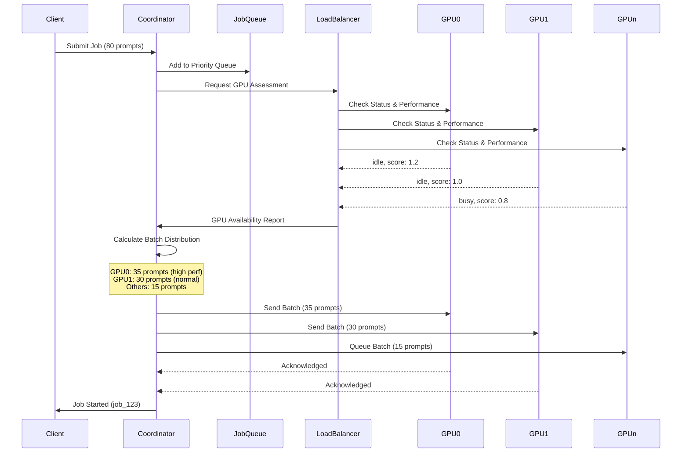
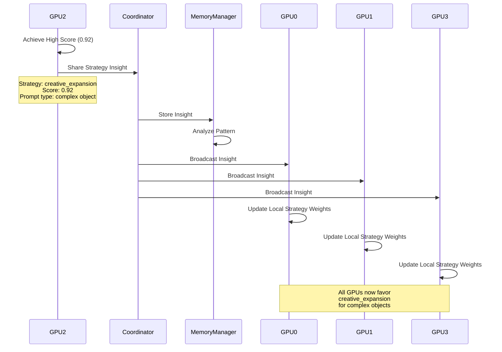

# Distributed RL System - Detailed Architecture & Implementation

## 🏗️ System Architecture Overview

### Three-Tier Architecture

```
┌─────────────────────────────────────────────────────────────────┐
│                     Presentation Tier                           │
│  Dashboard UI | WebSocket Clients | REST API Clients           │
└────────────────────────┬────────────────────────────────────────┘
                         │
┌────────────────────────┴────────────────────────────────────────┐
│                     Application Tier                            │
│  CPU Coordinator | Job Scheduler | Memory Manager | API Server  │
└────────────────────────┬────────────────────────────────────────┘
                         │
┌────────────────────────┴────────────────────────────────────────┐
│                     Processing Tier                             │
│  GPU 0-7 | RL Agents | TRELLIS Servers | Local Memory Caches   │
└─────────────────────────────────────────────────────────────────┘
```

## 📦 Component Deep Dive

### 1. CPU Coordinator Server (`distributed_rl_coordinator.py`)

#### Core Architecture
```python
import asyncio
import multiprocessing as mp
from typing import Dict, List, Optional, Any
from dataclasses import dataclass, field
from datetime import datetime
import redis
import aiohttp
from fastapi import FastAPI, WebSocket
import uvicorn

@dataclass
class JobRequest:
    job_id: str
    prompts: List[str]
    target_score: float = 0.85
    max_episodes: int = 10
    max_rounds_per_episode: int = 12
    improvement_threshold: float = 0.03
    priority: int = 1
    submitted_at: datetime = field(default_factory=datetime.now)
    status: str = "queued"
    assigned_gpus: Dict[int, List[str]] = field(default_factory=dict)

@dataclass
class GPUState:
    gpu_id: int
    port: int
    status: str  # idle, busy, error, maintenance
    current_job_id: Optional[str] = None
    current_batch: List[str] = field(default_factory=list)
    current_prompt_index: int = 0
    memory_used_gb: float = 0.0
    temperature_celsius: float = 0.0
    error_count: int = 0
    last_heartbeat: datetime = field(default_factory=datetime.now)
    performance_score: float = 1.0  # Performance multiplier for load balancing

class DistributedRLCoordinator:
    def __init__(self, 
                 num_gpus: int = 8,
                 base_gpu_port: int = 8096,
                 coordinator_port: int = 8090,
                 redis_host: str = "localhost",
                 redis_port: int = 6379):
        
        # Core configuration
        self.num_gpus = num_gpus
        self.base_gpu_port = base_gpu_port
        self.coordinator_port = coordinator_port
        
        # GPU management
        self.gpu_states: Dict[int, GPUState] = {}
        self._initialize_gpu_states()
        
        # Job management
        self.job_queue: List[JobRequest] = []
        self.active_jobs: Dict[str, JobRequest] = {}
        self.completed_jobs: Dict[str, Any] = {}
        
        # Memory management
        self.redis_client = redis.Redis(host=redis_host, port=redis_port, decode_responses=True)
        self.global_memory = GlobalMemoryManager(self.redis_client)
        
        # Communication
        self.gpu_clients: Dict[int, aiohttp.ClientSession] = {}
        self._initialize_gpu_clients()
        
        # Monitoring
        self.metrics_collector = MetricsCollector()
        self.health_monitor = HealthMonitor(self.gpu_states)
        
        # API server
        self.app = FastAPI(title="Distributed RL Coordinator")
        self._setup_api_routes()
        
        # WebSocket management
        self.websocket_manager = WebSocketManager()
        
        # Background tasks
        self.background_tasks = []
        
    def _initialize_gpu_states(self):
        """Initialize GPU state tracking"""
        for gpu_id in range(self.num_gpus):
            self.gpu_states[gpu_id] = GPUState(
                gpu_id=gpu_id,
                port=self.base_gpu_port + gpu_id,
                status="idle"
            )
    
    async def _initialize_gpu_clients(self):
        """Initialize HTTP clients for GPU communication"""
        for gpu_id in range(self.num_gpus):
            self.gpu_clients[gpu_id] = aiohttp.ClientSession(
                base_url=f"http://localhost:{self.base_gpu_port + gpu_id}"
            )
    
    async def submit_job(self, job_request: JobRequest) -> str:
        """Submit a new job to the queue"""
        # Validate job request
        if not self._validate_job_request(job_request):
            raise ValueError("Invalid job request")
        
        # Add to queue based on priority
        self._add_to_priority_queue(job_request)
        
        # Trigger job scheduling
        await self._schedule_next_job()
        
        # Notify dashboard
        await self.websocket_manager.broadcast({
            "type": "job_submitted",
            "job_id": job_request.job_id,
            "status": "queued"
        })
        
        return job_request.job_id
    
    async def _schedule_next_job(self):
        """Schedule the next job from queue"""
        if not self.job_queue:
            return
        
        # Check available GPU capacity
        available_gpus = self._get_available_gpus()
        if len(available_gpus) < 2:  # Minimum 2 GPUs to start a job
            return
        
        # Get highest priority job
        job = self._get_next_job()
        
        # Distribute prompts to GPUs
        gpu_assignments = await self._distribute_prompts(job.prompts, available_gpus)
        job.assigned_gpus = gpu_assignments
        
        # Move job to active
        self.active_jobs[job.job_id] = job
        job.status = "running"
        
        # Start processing on each GPU
        await self._start_gpu_processing(job, gpu_assignments)
        
        # Start monitoring task
        asyncio.create_task(self._monitor_job_progress(job.job_id))
    
    async def _distribute_prompts(self, 
                                 prompts: List[str], 
                                 available_gpus: List[int]) -> Dict[int, List[str]]:
        """Intelligently distribute prompts across available GPUs"""
        
        # Get GPU performance scores
        gpu_scores = {
            gpu_id: self.gpu_states[gpu_id].performance_score 
            for gpu_id in available_gpus
        }
        
        # Calculate weighted distribution
        total_score = sum(gpu_scores.values())
        gpu_weights = {
            gpu_id: score / total_score 
            for gpu_id, score in gpu_scores.items()
        }
        
        # Distribute prompts based on weights
        assignments = {gpu_id: [] for gpu_id in available_gpus}
        
        for i, prompt in enumerate(prompts):
            # Assign to GPU with lowest current load relative to capacity
            gpu_loads = {
                gpu_id: len(assignments[gpu_id]) / gpu_weights[gpu_id]
                for gpu_id in available_gpus
            }
            target_gpu = min(gpu_loads, key=gpu_loads.get)
            assignments[target_gpu].append(prompt)
        
        return assignments
    
    async def _start_gpu_processing(self, job: JobRequest, assignments: Dict[int, List[str]]):
        """Start processing on assigned GPUs"""
        tasks = []
        
        for gpu_id, prompt_batch in assignments.items():
            if prompt_batch:  # Only start if there are prompts
                task = asyncio.create_task(
                    self._send_batch_to_gpu(gpu_id, job.job_id, prompt_batch, job)
                )
                tasks.append(task)
                
                # Update GPU state
                self.gpu_states[gpu_id].status = "busy"
                self.gpu_states[gpu_id].current_job_id = job.job_id
                self.gpu_states[gpu_id].current_batch = prompt_batch
        
        # Wait for all GPUs to acknowledge
        await asyncio.gather(*tasks)
    
    async def _send_batch_to_gpu(self, 
                                gpu_id: int, 
                                job_id: str, 
                                prompts: List[str],
                                job: JobRequest):
        """Send prompt batch to specific GPU"""
        
        # Prepare request payload
        payload = {
            "job_id": job_id,
            "prompts": prompts,
            "target_score": job.target_score,
            "max_episodes": job.max_episodes,
            "max_rounds": job.max_rounds_per_episode,
            "improvement_threshold": job.improvement_threshold,
            "global_memory": await self.global_memory.get_relevant_memories(prompts)
        }
        
        # Send to GPU
        async with self.gpu_clients[gpu_id] as session:
            async with session.post("/process_batch", json=payload) as response:
                if response.status == 200:
                    result = await response.json()
                    self.logger.info(f"GPU {gpu_id} acknowledged batch for job {job_id}")
                    return result
                else:
                    self.logger.error(f"GPU {gpu_id} failed to accept batch: {response.status}")
                    await self._handle_gpu_failure(gpu_id, job_id, prompts)
    
    async def _monitor_job_progress(self, job_id: str):
        """Monitor job progress across all assigned GPUs"""
        job = self.active_jobs.get(job_id)
        if not job:
            return
        
        while job.status == "running":
            await asyncio.sleep(5)  # Check every 5 seconds
            
            # Collect progress from all GPUs
            progress_data = await self._collect_gpu_progress(job.assigned_gpus.keys())
            
            # Update job progress
            completed_prompts = sum(p.get("completed", 0) for p in progress_data.values())
            total_prompts = len(job.prompts)
            
            # Broadcast progress update
            await self.websocket_manager.broadcast({
                "type": "job_progress",
                "job_id": job_id,
                "completed": completed_prompts,
                "total": total_prompts,
                "percentage": (completed_prompts / total_prompts) * 100
            })
            
            # Check if job is complete
            if completed_prompts >= total_prompts:
                await self._complete_job(job_id)
                break
    
    async def _handle_gpu_failure(self, gpu_id: int, job_id: str, failed_prompts: List[str]):
        """Handle GPU failure and redistribute work"""
        self.logger.error(f"Handling GPU {gpu_id} failure for job {job_id}")
        
        # Mark GPU as error state
        self.gpu_states[gpu_id].status = "error"
        self.gpu_states[gpu_id].error_count += 1
        
        # Find available GPUs for redistribution
        available_gpus = [
            gid for gid, state in self.gpu_states.items()
            if state.status == "idle" and gid != gpu_id
        ]
        
        if available_gpus:
            # Redistribute failed prompts
            redistributed = await self._distribute_prompts(failed_prompts, available_gpus)
            
            # Update job assignments
            job = self.active_jobs[job_id]
            job.assigned_gpus[gpu_id] = []  # Clear failed GPU
            
            # Start processing on new GPUs
            await self._start_gpu_processing(job, redistributed)
        else:
            # No GPUs available, add back to queue
            self.logger.warning(f"No GPUs available for redistribution, requeueing prompts")
            # Implementation for requeuing...
    
    async def receive_gpu_update(self, gpu_id: int, update_type: str, data: Dict[str, Any]):
        """Receive updates from GPU agents"""
        
        if update_type == "strategy_insight":
            # Share strategy insight with other GPUs
            await self._broadcast_strategy_insight(gpu_id, data)
            
        elif update_type == "memory_update":
            # Update global memory
            await self.global_memory.update_from_gpu(gpu_id, data)
            
        elif update_type == "progress":
            # Update progress tracking
            job_id = data.get("job_id")
            if job_id in self.active_jobs:
                # Update internal progress tracking
                pass
        
        elif update_type == "error":
            # Handle GPU error
            await self._handle_gpu_error(gpu_id, data)
    
    async def _broadcast_strategy_insight(self, source_gpu: int, insight: Dict[str, Any]):
        """Broadcast successful strategy to other GPUs"""
        
        # Add to global insights
        self.global_memory.add_cross_gpu_insight(source_gpu, insight)
        
        # Broadcast to all other busy GPUs
        for gpu_id, state in self.gpu_states.items():
            if gpu_id != source_gpu and state.status == "busy":
                await self._send_insight_to_gpu(gpu_id, insight)
    
    def _setup_api_routes(self):
        """Setup FastAPI routes"""
        
        @self.app.post("/api/jobs/submit")
        async def submit_job(job_data: Dict[str, Any]):
            job_request = JobRequest(**job_data)
            job_id = await self.submit_job(job_request)
            return {"job_id": job_id, "status": "queued"}
        
        @self.app.get("/api/system/status")
        async def get_system_status():
            return {
                "status": "running",
                "gpus": {
                    gpu_id: {
                        "status": state.status,
                        "current_job": state.current_job_id,
                        "memory_used": state.memory_used_gb
                    }
                    for gpu_id, state in self.gpu_states.items()
                },
                "jobs": {
                    "queued": len(self.job_queue),
                    "active": len(self.active_jobs),
                    "completed": len(self.completed_jobs)
                }
            }
        
        @self.app.websocket("/ws/real_time_updates")
        async def websocket_endpoint(websocket: WebSocket):
            await self.websocket_manager.connect(websocket)
            try:
                while True:
                    # Keep connection alive and handle incoming messages
                    data = await websocket.receive_text()
                    # Process any client messages if needed
            except Exception as e:
                self.logger.error(f"WebSocket error: {e}")
            finally:
                self.websocket_manager.disconnect(websocket)
    
    async def start(self):
        """Start the coordinator server"""
        # Start background tasks
        self.background_tasks.append(
            asyncio.create_task(self._health_check_loop())
        )
        self.background_tasks.append(
            asyncio.create_task(self._memory_sync_loop())
        )
        
        # Start API server
        config = uvicorn.Config(
            app=self.app,
            host="0.0.0.0",
            port=self.coordinator_port,
            log_level="info"
        )
        server = uvicorn.Server(config)
        await server.serve()
```

### 2. Distributed RL Agent (`distributed_rl_agent.py`)

#### Enhanced GPU-Side Agent
```python
import asyncio
import aiohttp
from typing import List, Dict, Any, Optional
from dataclasses import dataclass
import torch
import logging
from pathlib import Path

# Import existing RL components
from smart_prompt_optimizer_v5_rl_loop import RLLoopAgent, OptimizationAttempt
from episodic_trellis_optimizer import EpisodicTrellisMemory

@dataclass
class BatchProcessingRequest:
    job_id: str
    prompts: List[str]
    target_score: float
    max_episodes: int
    max_rounds: int
    improvement_threshold: float
    global_memory: Dict[str, Any]

@dataclass
class PromptProcessingState:
    prompt: str
    current_episode: int
    current_round: int
    best_score: float
    best_prompt: str
    strategy_history: List[str]
    score_history: List[float]

class DistributedRLAgent(RLLoopAgent):
    """GPU-side RL agent with distributed processing capabilities"""
    
    def __init__(self, 
                 gpu_id: int,
                 port: int,
                 coordinator_url: str = "http://localhost:8090",
                 trellis_server_url: str = None,
                 **kwargs):
        
        # Initialize parent RLLoopAgent
        super().__init__(**kwargs)
        
        # Distributed configuration
        self.gpu_id = gpu_id
        self.port = port
        self.coordinator_url = coordinator_url
        
        # Override TRELLIS URL to use local GPU instance
        if trellis_server_url is None:
            self.trellis_server_url = f"http://localhost:{port}"
        
        # Local state management
        self.current_job_id: Optional[str] = None
        self.current_batch: List[str] = []
        self.processing_states: Dict[str, PromptProcessingState] = {}
        
        # Communication with coordinator
        self.coordinator_client = aiohttp.ClientSession()
        
        # Local memory cache for faster access
        self.local_memory_cache: Dict[str, EpisodicTrellisMemory] = {}
        
        # Cross-GPU insights buffer
        self.cross_gpu_insights: List[Dict[str, Any]] = []
        
        # Performance tracking
        self.gpu_metrics = GPUMetrics(gpu_id)
        
        # Setup logging
        self.logger = logging.getLogger(f"DistributedRLAgent-GPU{gpu_id}")
        
        # Start background tasks
        self.background_tasks = []
        self._start_background_tasks()
    
    async def process_batch(self, request: BatchProcessingRequest) -> Dict[str, Any]:
        """Process a batch of prompts from coordinator"""
        
        self.logger.info(f"GPU {self.gpu_id}: Starting batch processing for job {request.job_id}")
        self.logger.info(f"  Batch size: {len(request.prompts)}")
        
        # Update local state
        self.current_job_id = request.job_id
        self.current_batch = request.prompts
        
        # Load global memory into local cache
        await self._load_global_memory(request.global_memory)
        
        # Initialize processing states
        for prompt in request.prompts:
            self.processing_states[prompt] = PromptProcessingState(
                prompt=prompt,
                current_episode=0,
                current_round=0,
                best_score=0.0,
                best_prompt=prompt,
                strategy_history=[],
                score_history=[]
            )
        
        # Process prompts
        results = []
        for i, prompt in enumerate(request.prompts):
            self.logger.info(f"GPU {self.gpu_id}: Processing prompt {i+1}/{len(request.prompts)}")
            
            # Process single prompt with episodic optimization
            result = await self._process_single_prompt(
                prompt,
                request.target_score,
                request.max_episodes,
                request.max_rounds,
                request.improvement_threshold
            )
            
            results.append(result)
            
            # Send progress update to coordinator
            await self._send_progress_update(i + 1, len(request.prompts))
            
            # Share successful strategies if score is good
            if result['final_score'] > 0.8:
                await self._share_strategy_insight(prompt, result)
        
        # Send final results to coordinator
        batch_results = {
            'job_id': request.job_id,
            'gpu_id': self.gpu_id,
            'prompts_processed': len(results),
            'results': results,
            'average_score': sum(r['final_score'] for r in results) / len(results),
            'processing_time': self.gpu_metrics.get_batch_processing_time()
        }
        
        await self._send_batch_results(batch_results)
        
        # Update local memory cache with results
        await self._update_local_memory(results)
        
        # Clear batch state
        self.current_job_id = None
        self.current_batch = []
        self.processing_states.clear()
        
        return batch_results
    
    async def _process_single_prompt(self, 
                                    prompt: str,
                                    target_score: float,
                                    max_episodes: int,
                                    max_rounds: int,
                                    improvement_threshold: float) -> Dict[str, Any]:
        """Process a single prompt with episodic optimization"""
        
        state = self.processing_states[prompt]
        best_overall_score = 0.0
        best_overall_prompt = prompt
        
        for episode in range(max_episodes):
            state.current_episode = episode
            
            # Build context with local and cross-GPU insights
            context = self._build_enhanced_context(prompt, state)
            
            # Run RL optimization loop
            result = self.optimize_with_rl_loop(
                prompt=best_overall_prompt,  # Start from best so far
                use_validation=True,
                prompt_with_context=context
            )
            
            # Update state
            state.score_history.append(result['final_score'])
            state.strategy_history.extend(result.get('strategy_sequence', []))
            
            if result['final_score'] > best_overall_score:
                best_overall_score = result['final_score']
                best_overall_prompt = result['final_optimized_prompt']
                state.best_score = best_overall_score
                state.best_prompt = best_overall_prompt
            
            # Check if target achieved
            if best_overall_score >= target_score:
                self.logger.info(f"GPU {self.gpu_id}: Target achieved for '{prompt[:30]}...' Score: {best_overall_score:.4f}")
                break
            
            # Check for improvement
            if episode > 0:
                recent_scores = state.score_history[-3:]
                if len(recent_scores) >= 3:
                    improvement = max(recent_scores) - min(recent_scores)
                    if improvement < improvement_threshold:
                        self.logger.info(f"GPU {self.gpu_id}: Low improvement, stopping early")
                        break
        
        return {
            'original_prompt': prompt,
            'final_prompt': best_overall_prompt,
            'final_score': best_overall_score,
            'episodes_run': state.current_episode + 1,
            'total_rounds': len(state.strategy_history),
            'score_progression': state.score_history,
            'strategy_sequence': state.strategy_history,
            'gpu_id': self.gpu_id
        }
    
    def _build_enhanced_context(self, prompt: str, state: PromptProcessingState) -> str:
        """Build context with local memory and cross-GPU insights"""
        
        context_parts = []
        
        # Add historical context from local memory
        if prompt in self.local_memory_cache:
            memory = self.local_memory_cache[prompt]
            context_parts.append(f"""
HISTORICAL CONTEXT:
- Best score to beat: {memory.best_score:.4f}
- Best prompt: "{memory.best_prompt}"
- Episodes run: {memory.episodes_run}
- Successful strategies: {memory.successful_patterns}
""")
        
        # Add current state context
        if state.score_history:
            context_parts.append(f"""
CURRENT PROGRESS:
- Current episode: {state.current_episode}
- Best score so far: {state.best_score:.4f}
- Recent scores: {state.score_history[-5:]}
- Strategies tried: {set(state.strategy_history[-10:])}
""")
        
        # Add cross-GPU insights
        relevant_insights = self._get_relevant_insights(prompt)
        if relevant_insights:
            context_parts.append(f"""
CROSS-GPU INSIGHTS:
{self._format_insights(relevant_insights)}
""")
        
        # Add GPU-specific context
        context_parts.append(f"""
GPU CONTEXT:
- GPU ID: {self.gpu_id}
- Processing prompt {self.current_batch.index(prompt) + 1}/{len(self.current_batch)}
- Job ID: {self.current_job_id}
""")
        
        return "\n".join(context_parts)
    
    def _get_relevant_insights(self, prompt: str) -> List[Dict[str, Any]]:
        """Get relevant cross-GPU insights for the prompt"""
        
        # Simple keyword matching for now
        prompt_words = set(prompt.lower().split())
        relevant = []
        
        for insight in self.cross_gpu_insights[-20:]:  # Last 20 insights
            insight_prompt = insight.get('prompt', '').lower()
            insight_words = set(insight_prompt.split())
            
            # Check for overlap
            if prompt_words & insight_words:
                relevant.append(insight)
        
        return relevant[:5]  # Return top 5 most relevant
    
    async def _send_progress_update(self, completed: int, total: int):
        """Send progress update to coordinator"""
        
        update = {
            'gpu_id': self.gpu_id,
            'job_id': self.current_job_id,
            'completed': completed,
            'total': total,
            'current_prompt': self.current_batch[completed - 1] if completed > 0 else None
        }
        
        try:
            async with self.coordinator_client.post(
                f"{self.coordinator_url}/gpu_update",
                json={
                    'gpu_id': self.gpu_id,
                    'update_type': 'progress',
                    'data': update
                }
            ) as response:
                if response.status != 200:
                    self.logger.warning(f"Failed to send progress update: {response.status}")
        except Exception as e:
            self.logger.error(f"Error sending progress update: {e}")
    
    async def _share_strategy_insight(self, prompt: str, result: Dict[str, Any]):
        """Share successful strategy with coordinator"""
        
        insight = {
            'gpu_id': self.gpu_id,
            'prompt': prompt,
            'strategy': result.get('strategy_sequence', [])[-1] if result.get('strategy_sequence') else 'unknown',
            'score': result['final_score'],
            'improvement': result['final_score'] - result.get('initial_score', 0),
            'prompt_characteristics': self._analyze_prompt_characteristics(prompt)
        }
        
        try:
            async with self.coordinator_client.post(
                f"{self.coordinator_url}/gpu_update",
                json={
                    'gpu_id': self.gpu_id,
                    'update_type': 'strategy_insight',
                    'data': insight
                }
            ) as response:
                if response.status == 200:
                    self.logger.info(f"Shared strategy insight for score {result['final_score']:.4f}")
        except Exception as e:
            self.logger.error(f"Error sharing strategy insight: {e}")
    
    def _analyze_prompt_characteristics(self, prompt: str) -> Dict[str, Any]:
        """Analyze prompt characteristics for pattern matching"""
        
        words = prompt.lower().split()
        
        return {
            'length': len(words),
            'has_color': any(color in words for color in ['red', 'blue', 'green', 'yellow']),
            'has_material': any(mat in words for mat in ['wooden', 'metal', 'glass', 'ceramic']),
            'has_size': any(size in words for size in ['small', 'large', 'tiny', 'huge']),
            'complexity': 'complex' if len(words) > 10 else 'simple'
        }
    
    async def receive_cross_gpu_insight(self, insight: Dict[str, Any]):
        """Receive insight from another GPU via coordinator"""
        
        # Add to local buffer
        self.cross_gpu_insights.append(insight)
        
        # Keep buffer size manageable
        if len(self.cross_gpu_insights) > 100:
            self.cross_gpu_insights = self.cross_gpu_insights[-50:]
        
        self.logger.debug(f"Received insight from GPU {insight.get('gpu_id')}: {insight.get('strategy')} -> {insight.get('score'):.4f}")
    
    async def _start_background_tasks(self):
        """Start background monitoring and sync tasks"""
        
        # Heartbeat to coordinator
        async def heartbeat_loop():
            while True:
                await asyncio.sleep(10)
                await self._send_heartbeat()
        
        # GPU metrics collection
        async def metrics_loop():
            while True:
                await asyncio.sleep(5)
                self.gpu_metrics.update()
        
        self.background_tasks.append(asyncio.create_task(heartbeat_loop()))
        self.background_tasks.append(asyncio.create_task(metrics_loop()))
    
    async def _send_heartbeat(self):
        """Send heartbeat to coordinator"""
        
        try:
            metrics = self.gpu_metrics.get_current_metrics()
            
            async with self.coordinator_client.post(
                f"{self.coordinator_url}/gpu_heartbeat",
                json={
                    'gpu_id': self.gpu_id,
                    'status': 'busy' if self.current_job_id else 'idle',
                    'metrics': metrics
                }
            ) as response:
                pass  # Heartbeat sent
        except Exception as e:
            self.logger.error(f"Heartbeat failed: {e}")
    
    async def start_server(self):
        """Start the GPU agent server"""
        
        from fastapi import FastAPI
        import uvicorn
        
        app = FastAPI(title=f"GPU {self.gpu_id} RL Agent")
        
        @app.post("/process_batch")
        async def process_batch_endpoint(request_data: Dict[str, Any]):
            request = BatchProcessingRequest(**request_data)
            result = await self.process_batch(request)
            return result
        
        @app.post("/receive_insight")
        async def receive_insight_endpoint(insight: Dict[str, Any]):
            await self.receive_cross_gpu_insight(insight)
            return {"status": "received"}
        
        @app.get("/status")
        async def get_status():
            return {
                'gpu_id': self.gpu_id,
                'status': 'busy' if self.current_job_id else 'idle',
                'current_job': self.current_job_id,
                'batch_size': len(self.current_batch),
                'metrics': self.gpu_metrics.get_current_metrics()
            }
        
        config = uvicorn.Config(
            app=app,
            host="0.0.0.0",
            port=self.port,
            log_level="info"
        )
        server = uvicorn.Server(config)
        await server.serve()

class GPUMetrics:
    """Track GPU performance metrics"""
    
    def __init__(self, gpu_id: int):
        self.gpu_id = gpu_id
        self.start_time = None
        self.prompts_processed = 0
        self.total_processing_time = 0.0
        
    def update(self):
        """Update GPU metrics"""
        try:
            import pynvml
            pynvml.nvmlInit()
            handle = pynvml.nvmlDeviceGetHandleByIndex(self.gpu_id)
            
            # Get memory info
            mem_info = pynvml.nvmlDeviceGetMemoryInfo(handle)
            self.memory_used_gb = mem_info.used / (1024**3)
            self.memory_total_gb = mem_info.total / (1024**3)
            
            # Get utilization
            self.utilization = pynvml.nvmlDeviceGetUtilizationRates(handle).gpu
            
            # Get temperature
            self.temperature = pynvml.nvmlDeviceGetTemperature(handle, pynvml.NVML_TEMPERATURE_GPU)
            
        except Exception as e:
            # Fallback to torch if pynvml not available
            if torch.cuda.is_available():
                self.memory_used_gb = torch.cuda.memory_allocated(self.gpu_id) / (1024**3)
                self.memory_total_gb = torch.cuda.get_device_properties(self.gpu_id).total_memory / (1024**3)
    
    def get_current_metrics(self) -> Dict[str, Any]:
        """Get current GPU metrics"""
        return {
            'memory_used_gb': getattr(self, 'memory_used_gb', 0),
            'memory_total_gb': getattr(self, 'memory_total_gb', 24),
            'utilization_percent': getattr(self, 'utilization', 0),
            'temperature_celsius': getattr(self, 'temperature', 0),
            'prompts_processed': self.prompts_processed
        }
```

## 🔄 Workflow Sequence Diagrams

### Job Submission and Distribution Flow



### Cross-GPU Strategy Sharing Flow



## 🛡️ Error Handling & Recovery

### GPU Failure Recovery Flow

```python
class FailureRecoveryManager:
    """Comprehensive failure recovery system"""
    
    def __init__(self, coordinator: DistributedRLCoordinator):
        self.coordinator = coordinator
        self.checkpoints: Dict[str, GPUCheckpoint] = {}
        self.recovery_strategies = {
            'memory_error': self._handle_memory_error,
            'timeout': self._handle_timeout,
            'crash': self._handle_crash,
            'network': self._handle_network_error
        }
    
    async def detect_and_handle_failure(self, gpu_id: int, error_type: str, context: Dict[str, Any]):
        """Main failure detection and handling"""
        
        self.logger.warning(f"Detected {error_type} on GPU {gpu_id}")
        
        # Save checkpoint if possible
        if error_type != 'crash':
            await self._save_checkpoint(gpu_id, context)
        
        # Execute recovery strategy
        recovery_strategy = self.recovery_strategies.get(error_type, self._handle_generic_error)
        success = await recovery_strategy(gpu_id, context)
        
        if success:
            self.logger.info(f"Successfully recovered GPU {gpu_id}")
            # Restore from checkpoint
            if gpu_id in self.checkpoints:
                await self._restore_checkpoint(gpu_id)
        else:
            # Escalate to redistribution
            await self._escalate_failure(gpu_id, context)
    
    async def _handle_memory_error(self, gpu_id: int, context: Dict[str, Any]) -> bool:
        """Handle GPU memory errors"""
        
        # Try to clear memory
        await self.coordinator.gpu_clients[gpu_id].post("/clear_memory")
        
        # Reduce batch size for this GPU
        self.coordinator.gpu_states[gpu_id].performance_score *= 0.8
        
        # Wait for memory to clear
        await asyncio.sleep(10)
        
        # Test if GPU is responsive
        try:
            async with self.coordinator.gpu_clients[gpu_id].get("/status") as response:
                if response.status == 200:
                    return True
        except:
            pass
        
        return False
    
    async def _redistribute_work(self, failed_gpu_id: int, remaining_prompts: List[str]):
        """Redistribute work from failed GPU to healthy ones"""
        
        # Find healthy GPUs with capacity
        healthy_gpus = [
            gpu_id for gpu_id, state in self.coordinator.gpu_states.items()
            if state.status in ['idle', 'busy'] and gpu_id != failed_gpu_id
        ]
        
        if not healthy_gpus:
            self.logger.error("No healthy GPUs available for redistribution")
            return False
        
        # Calculate redistribution
        prompts_per_gpu = len(remaining_prompts) // len(healthy_gpus)
        remainder = len(remaining_prompts) % len(healthy_gpus)
        
        redistributed = {}
        start_idx = 0
        
        for i, gpu_id in enumerate(healthy_gpus):
            count = prompts_per_gpu + (1 if i < remainder else 0)
            redistributed[gpu_id] = remaining_prompts[start_idx:start_idx + count]
            start_idx += count
        
        # Send redistributed work
        for gpu_id, prompts in redistributed.items():
            if prompts:
                await self.coordinator._send_batch_to_gpu(
                    gpu_id,
                    self.coordinator.gpu_states[failed_gpu_id].current_job_id,
                    prompts,
                    self.coordinator.active_jobs[self.coordinator.gpu_states[failed_gpu_id].current_job_id]
                )
        
        return True
```

## 📊 Performance Monitoring & Analytics

### Real-time Metrics Collection

```python
class MetricsCollector:
    """Collect and aggregate system-wide metrics"""
    
    def __init__(self):
        self.metrics_buffer = []
        self.aggregated_metrics = {}
        self.time_series_data = defaultdict(list)
        
    async def collect_gpu_metrics(self, gpu_states: Dict[int, GPUState]) -> Dict[str, Any]:
        """Collect metrics from all GPUs"""
        
        timestamp = datetime.now()
        
        metrics = {
            'timestamp': timestamp.isoformat(),
            'gpus': {},
            'aggregate': {
                'total_memory_used_gb': 0,
                'average_utilization': 0,
                'average_temperature': 0,
                'busy_gpus': 0,
                'idle_gpus': 0,
                'error_gpus': 0
            }
        }
        
        utilization_sum = 0
        temperature_sum = 0
        active_gpu_count = 0
        
        for gpu_id, state in gpu_states.items():
            gpu_metric = {
                'status': state.status,
                'memory_used_gb': state.memory_used_gb,
                'temperature': state.temperature_celsius,
                'current_job': state.current_job_id,
                'error_count': state.error_count,
                'performance_score': state.performance_score
            }
            
            metrics['gpus'][gpu_id] = gpu_metric
            
            # Update aggregates
            metrics['aggregate']['total_memory_used_gb'] += state.memory_used_gb
            
            if state.status == 'busy':
                metrics['aggregate']['busy_gpus'] += 1
                utilization_sum += 95  # Assume high utilization when busy
                active_gpu_count += 1
            elif state.status == 'idle':
                metrics['aggregate']['idle_gpus'] += 1
            elif state.status == 'error':
                metrics['aggregate']['error_gpus'] += 1
            
            if state.temperature_celsius > 0:
                temperature_sum += state.temperature_celsius
        
        # Calculate averages
        if active_gpu_count > 0:
            metrics['aggregate']['average_utilization'] = utilization_sum / active_gpu_count
        
        if len(gpu_states) > 0:
            metrics['aggregate']['average_temperature'] = temperature_sum / len(gpu_states)
        
        # Add to time series
        self._update_time_series(metrics)
        
        return metrics
    
    def _update_time_series(self, metrics: Dict[str, Any]):
        """Update time series data for charts"""
        
        timestamp = metrics['timestamp']
        
        # Keep last hour of data (720 points at 5-second intervals)
        max_points = 720
        
        self.time_series_data['timestamps'].append(timestamp)
        self.time_series_data['busy_gpus'].append(metrics['aggregate']['busy_gpus'])
        self.time_series_data['memory_used'].append(metrics['aggregate']['total_memory_used_gb'])
        self.time_series_data['average_utilization'].append(metrics['aggregate']['average_utilization'])
        
        # Trim old data
        for key in self.time_series_data:
            if len(self.time_series_data[key]) > max_points:
                self.time_series_data[key] = self.time_series_data[key][-max_points:]
    
    def get_dashboard_metrics(self) -> Dict[str, Any]:
        """Get metrics formatted for dashboard display"""
        
        return {
            'current': self.aggregated_metrics,
            'time_series': dict(self.time_series_data),
            'performance_summary': self._calculate_performance_summary()
        }
    
    def _calculate_performance_summary(self) -> Dict[str, Any]:
        """Calculate performance summary statistics"""
        
        if not self.time_series_data['busy_gpus']:
            return {}
        
        recent_utilization = self.time_series_data['average_utilization'][-12:]  # Last minute
        
        return {
            'average_gpu_utilization': sum(recent_utilization) / len(recent_utilization) if recent_utilization else 0,
            'peak_memory_usage': max(self.time_series_data['memory_used']) if self.time_series_data['memory_used'] else 0,
            'gpu_efficiency': self._calculate_efficiency()
        }
    
    def _calculate_efficiency(self) -> float:
        """Calculate overall system efficiency"""
        
        # Efficiency = (busy_gpus / total_gpus) * average_utilization
        if not self.time_series_data['busy_gpus']:
            return 0.0
        
        recent_busy = self.time_series_data['busy_gpus'][-12:]
        recent_util = self.time_series_data['average_utilization'][-12:]
        
        avg_busy = sum(recent_busy) / len(recent_busy)
        avg_util = sum(recent_util) / len(recent_util) if recent_util else 0
        
        efficiency = (avg_busy / 8.0) * (avg_util / 100.0)  # Assuming 8 GPUs total
        
        return min(efficiency, 1.0)  # Cap at 100%
```

This expanded architecture provides a robust foundation for the distributed RL system with comprehensive error handling, performance monitoring, and cross-GPU communication capabilities.


