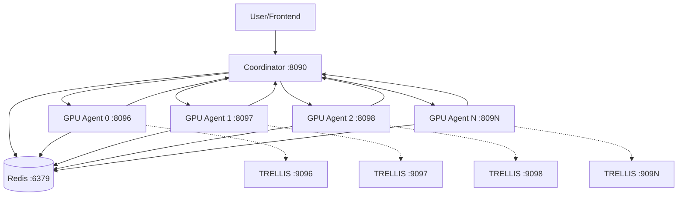

# System Architecture & File Structure Map

## 📁 File Structure Overview

```
distributed-rl-system/
├── config/                           # Configuration & Settings
│   ├── __init__.py                   
│   └── settings.py                   # Global system configuration
│
├── utils/                            # Shared utilities
│   ├── __init__.py
│   └── logging_config.py             # Logging setup for all components
│
├── src/                              # Core system components
│   ├── coordinator/                  # CPU Coordinator Layer
│   │   ├── __init__.py
│   │   ├── simple_coordinator.py     # ✅ WORKING: Main coordinator
│   │   ├── distributed_coordinator.py # 🔧 ADVANCED: Full Phase 3 coordinator
│   │   ├── results_aggregator.py     # Phase 3: Results analysis
│   │   ├── job_queue/
│   │   │   ├── __init__.py
│   │   │   └── manager.py             # Job queue management
│   │   ├── batch_splitter/
│   │   │   ├── __init__.py
│   │   │   └── analyzer.py            # Intelligent prompt batching
│   │   └── load_balancer/
│   │       ├── __init__.py
│   │       └── gpu_balancer.py        # GPU load balancing
│   │
│   ├── gpu_agent/                    # GPU Processing Layer
│   │   ├── simple_gpu_agent.py       # ✅ WORKING: Main GPU agent
│   │   ├── distributed_rl_agent.py   # 🔧 ADVANCED: Full Phase 2 agent
│   │   └── main.py                   # GPU agent wrapper
│   │
│   └── memory/                       # Memory Management Layer
│       └── episodic_loader.py        # Episodic memory & Redis integration
│
├── scripts/                          # System startup & management
│   ├── start_simple_system.py        # ✅ WORKING: Complete system startup
│   ├── phase1/
│   │   └── start_system.py           # Phase 1 startup
│   ├── phase2/
│   │   └── start_phase2_system.py    # Phase 2 startup
│   └── phase3/
│       └── start_phase3_system.py    # Phase 3 startup
│
├── logs/                             # Log files (auto-created)
├── data/                             # Data storage (auto-created)
├── cache/                            # Cache directory (auto-created)
│
├── test_simple_system.py             # ✅ WORKING: Comprehensive tests
├── README_SIMPLE_WORKING_SYSTEM.md   # Complete usage guide
└── SYSTEM_ARCHITECTURE_MAP.md        # This file
```

## 🔗 Communication Flow Map

### **Primary Communication Paths**



### **Communication Protocols**

| Source | Target | Protocol | Purpose | Port |
|--------|--------|----------|---------|------|
| **User/Frontend** | Coordinator | HTTP REST | Job submission, status | 8090 |
| **User/Frontend** | Coordinator | WebSocket | Real-time updates | 8090 |
| **Coordinator** | GPU Agents | HTTP POST | Batch assignment | 8096-8103 |
| **GPU Agents** | Coordinator | HTTP POST | Progress, insights, completion | 8090 |
| **All Components** | Redis | Redis Protocol | Memory storage | 6379 |
| **GPU Agents** | TRELLIS | HTTP POST | 3D generation (future) | 9096-9103 |

## 📋 Component Communication Details

### **1. Coordinator (`simple_coordinator.py`) - Port 8090**

#### **Incoming Communications:**
- **FROM User/Frontend**: Job submissions, status requests
- **FROM GPU Agents**: Progress updates, insights, batch completions

#### **Outgoing Communications:**
- **TO GPU Agents**: Batch assignments, insight broadcasts
- **TO Redis**: Memory storage and retrieval
- **TO User/Frontend**: Status updates, job results

#### **Key Methods:**
```python
# API Endpoints (FROM User/Frontend)
POST /api/jobs/submit           # Submit new job
GET  /api/jobs/{job_id}         # Get job status  
GET  /api/system/status         # Get system status
GET  /api/insights              # Get cross-GPU insights

# GPU Communication Endpoints (FROM GPU Agents)
POST /gpu_insight               # Receive strategy insight
POST /gpu_progress              # Receive progress update
POST /batch_complete            # Receive batch completion
POST /request_memory_sync       # Handle memory sync

# WebSocket Endpoints (TO User/Frontend)
WS   /ws/updates                # Real-time updates stream
```

### **2. GPU Agent (`simple_gpu_agent.py`) - Ports 8096-8103**

#### **Incoming Communications:**
- **FROM Coordinator**: Batch assignments, cross-GPU insights
- **FROM User** (standalone): Single prompt tests

#### **Outgoing Communications:**
- **TO Coordinator**: Progress updates, insights, completions
- **TO TRELLIS** (future): 3D generation requests

#### **Key Methods:**
```python
# Coordinator Communication (FROM Coordinator)
POST /process_batch             # Process prompt batch
POST /receive_insight           # Receive cross-GPU insight

# Standalone Testing (FROM User)
POST /test_prompt               # Test single prompt

# Status & Health
GET  /status                    # Get agent status
GET  /health                    # Health check

# Internal Methods (TO Coordinator)
_send_progress_update()         # Send progress
_share_strategy_insight()       # Share insight
_send_batch_completion()        # Send completion
```

### **3. Configuration (`config/settings.py`)**

#### **Global Settings Used By All Components:**
```python
# Port Configuration
coordinator_port: int = 8090        # Coordinator API port
base_gpu_port: int = 8096          # Base port for GPU agents
redis_port: int = 6379             # Redis port

# System Configuration  
num_gpus: int = 8                  # Number of GPU agents
max_concurrent_jobs: int = 3       # Max parallel jobs

# Performance Settings
gpu_health_check_interval: int = 30  # Health check frequency
memory_sync_interval: int = 300      # Memory sync frequency
```

### **4. Logging (`utils/logging_config.py`)**

#### **Used By All Components For:**
- Structured logging to console and files
- Component-specific log files in `logs/` directory
- Debug, info, warning, error level logging

## 🔄 Data Flow Examples

### **Example 1: Job Submission**
```
1. User → POST /api/jobs/submit → Coordinator
2. Coordinator → Splits prompts into batches
3. Coordinator → POST /process_batch → GPU Agents (multiple)
4. GPU Agents → Process prompts with RL optimization
5. GPU Agents → POST /gpu_progress → Coordinator (periodic)
6. GPU Agents → POST /gpu_insight → Coordinator (on good results)
7. Coordinator → POST /receive_insight → Other GPU Agents
8. GPU Agents → POST /batch_complete → Coordinator
9. Coordinator → Aggregates results
10. User → GET /api/jobs/{job_id} → Coordinator (final results)
```

### **Example 2: Real-time Monitoring**
```
1. Frontend → WS connect /ws/updates → Coordinator
2. Coordinator → Streams real-time updates → Frontend
3. Frontend → Displays live GPU status, progress, insights
```

### **Example 3: Cross-GPU Learning**
```
1. GPU 0 → Achieves high score (0.9+)
2. GPU 0 → POST /gpu_insight → Coordinator
3. Coordinator → Stores insight globally
4. Coordinator → POST /receive_insight → All other busy GPUs
5. GPU 1,2,3... → Use insight for strategy selection
```

## 🧪 Testing Communication

### **Health Check Chain:**
```bash
# Test coordinator
curl http://localhost:8090/health

# Test GPU agents
curl http://localhost:8096/health  # GPU 0
curl http://localhost:8097/health  # GPU 1
# ... etc
```

### **Component Integration Test:**
```bash
# Run comprehensive test
python test_simple_system.py

# Tests: Coordinator health → GPU agent health → 
#        Single prompt → Job submission → Cross-GPU insights
```

This architecture provides clear separation of concerns while enabling efficient communication between all components for distributed RL processing.


